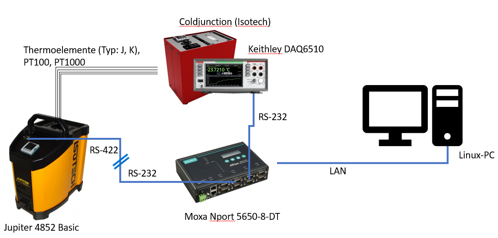
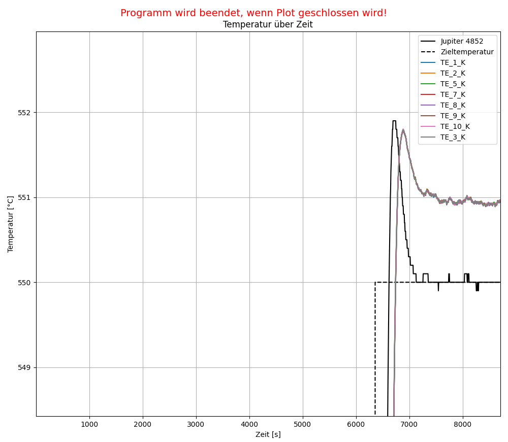

# meas-temperature-calibration
Calibration of temperature sensors.

## 1. About Us:
This project is used to calibrate thermocouples with the help of the "Isotech Jupiter 4852 Basic" temperature calibrator. The goal is to completely automate the calibration process with python scripts.

The project is being processed by the model experiments group at the IKZ - Leibniz Institut für Kristallzüchtung.

---
## 2. Introduction:
---
## 3. Operation manual:
__Isotech Jupiter 4852 Basic:__
https://isotech.co.uk/wp-content/uploads/2020/09/BASIC-SITE-Jupiter.pdf
in English
__Comunications Manual between Jupiter 4852 Basic and PC with Modbus__
https://www.eurotherm.com/?wpdmdl=27877
in English

## 4. jupiter4852.py:
jupiter4852.py allows comunication with the Jupiter 4852. Currently the current temperature can be read out and the setpoint can be read and written.

## 5. Hardware setup:

As the Computer a Raspberry Pi 400 was used. __The Jupiter 4852 must be connected to the comupter using the official adapter by Isotherm!__ A RS232 to USB adapter can be used to connect to the computer after the Isoterm adapter.

## 6. Software setup:
### 6.1 Jupiter:

__Comms Resolution "rES" musst be "XX.X °C" not "XX.XX °C" which is used per defult.__

__Modbus Address musst be "2" even if Cal Notepad apeaers to comunicate with "1".__

For comunication asure that defualt settings are used:
Baudrate: 9600
Parity:   None
bytesize: 8
stopbits: 1

### 6.2 Script:

_rezept.txt_ has to be configured to needs. a explanations can be found there.

_config.yml_ has to be configured to needs. An example can be found.

If everything is configuered Hauptprogramm.py can be started. If a seperate window opens with a graph that updates every 5s everythng works as intendet. The Script closes automaticly. If more then 8h pass the script will close automaticly even if the program is not finnished.

## 7. Output:
A folder will be created which holds the follwing files: _plot.png_ saves the plot. data.csv stores all data. measermentData.csv stores averaged data during measerments.
